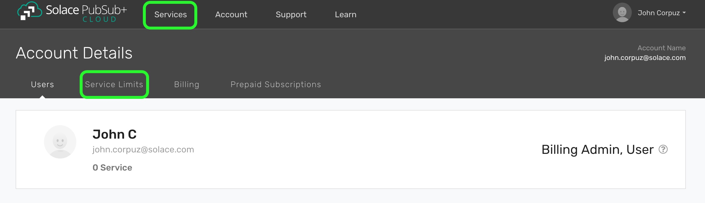

How to Increase Your Capacity or Number of Services
====================================

The number of plans you can create is limited by the service limits set in your organization. For example, free users are only able to create free service plans. For enterprise users, your organization may also be limited in the number of services that can be created.

Requesting a Service Limit Increase from PubSub+ Cloud Console
~~~~~~~~~~~~~~~~~~~~~~~~~~~~~~~~~~~~~~~~~~~~~~~~~~~~

1. Login into Solace Cloud

2. Click on Account on the top menu, and service limits tab on under Account Details

3. On the service limit table, you can click on "Request Service Increase" for each plan of interest.

4. A dialog box will then show up, you may then specify the number of services you would require, and any accompanying details.
Click on "Send Request".

Our product support team should receive your request, and will follow up with you the soonest.
